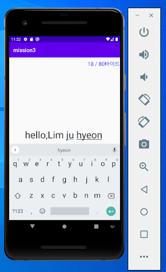

# 19173043 임주현

## 1주차 과제

## 2주차 과제
 </img>

## 3주차 과제
</img>

## 4주차 과제
</img>

## 7주차 과제
</img>

## 9주차 과제
</img>
</img>
</img>

## 10주차 과제
</img>
</img>
</img>

## 11주차 과제
</img>
</img>
</img>
</img>

## 12주차 과제
</img>
